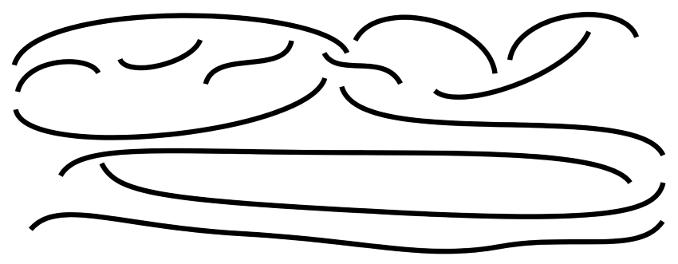
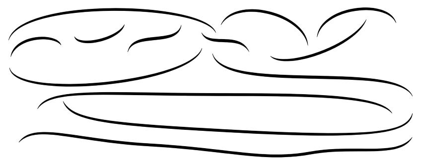

# SlurTemplateConverter
This web application converts slur templates in SVG files to proper, pointed slurs.<br /><br />
For example, these slur templates<br />
<br/>
are converted to the following slurs:<br />
<br/>
Usage:<br />
1. Load the application by visiting https://james-ingram-act-two.de/open-source/SlurTemplateConverter/
2. Load a local SVG file by clicking the button provided.
3. Click the "Convert Templates" button at the top of the page.
4. All the slur templates in the file are converted to slurs.
5. The resulting file is automatically saved (on Windows, in the "Downloads" folder) using the original name prefixed by "converted_". 

Details:<br />
- A slur template is an SVG path element having class "slurTemplate".
- A slur is an SVG path element having class "slur".
- Each slur is created next to the slur template it replaces, before the template is deleted.
- Both the "slur" and "slurTemplate" classes must exist in the SVG's CSS styles. They are used but not created by this application.
The slurTemplate's stroke-width affects the maximum thickness of the created slur. It is typically set to (Gap/2)px, where Gap is the vertical distance between two stafflines.
- Both the "slur" and the "slurTemplate" use absolute coordinates in the SVG path (i.e. M, C and S, not m, c, and s.)


A simple, two-point template path has a d-attribute consisting of an "M" and a "C" component:<br />
```
<path class="slurTemplate" d="M p1x, p1y C c1x, c1y, c2x, c2y, p2x, p2y" />
```
For example:
```
<path class="slurTemplate" d="M40,219C61,103,285,70,342,104" />
```

A multi-point slur template path has one or more additional "S" components, so a three-point template has the form:
```
<path class="slurTemplate" d="M p1x, p1y C c1x, c1y, c2x, c2y, p2x, p2y S c3x, c3y, p3x, p3y" />
```
For example:
```
<path class="slurTemplate" d="M307,220C356,209,435,201,507,183S614,84,753,99" />
```
And a four-point template has the form:
```
<path class="slurTemplate" d="M p1x, p1y C c1x, c1y, c2x, c2y, p2x, p2y S c3x, c3y, p3x, p3y S c4x, c4y, p4x, p4y" />
```
etc.
